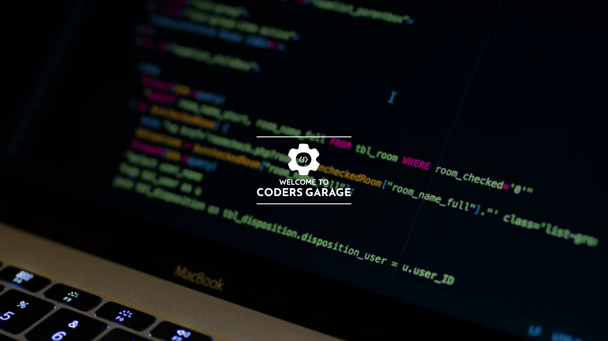

<h2 align="center">
	React Coding Website<br/>
	<a href="https://coders-garage.netlify.app/" target="_blank">Coders Garage</a>
</h2>

<div align="center">
	
</div>

<br/>

<center>

[](https://forthebadge.com) &nbsp;
[](https://forthebadge.com) &nbsp;
[](https://forthebadge.com) &nbsp;
</center>

<h3 align="center">
    🔹
    <a href="https://github.com/Samyc2002/Coders-Garage/issues">Report Bug</a> &nbsp; &nbsp;
    🔹
    <a href="https://github.com/Samyc2002/Coders-Garage/issues">Request Feature</a>
</h3>

## TL;DR

You can fork this repo to modify and make changes of your own. Please give me proper credit by linking back to [Samyc2002](https://github.com/Samyc2002/Coders-Garage). Thanks!

## Built With

A coding website <a href="https://coders-garage.netlify.app/" target="_blank">Coders Garage</a> which has a Home page where questions are available, an IDE that can be used by anyone and has a user friendly interview platform. It has a soothing and minimal UI.<br/>

This project was built using these technologies.

- React.js
- Node.js
- Express.js
- MongoDB
- Material UI
- CSS3
- VsCode
- Heroku
- Figma

## Features

**📖 Multi-Page Layout**

**🎨 Styled with Material UI and CSS with easy to customize colors**

**📱 Fully Responsive**

## Getting Started

Clone down this repository. You will need `node.js` and `git` installed globally on your machine.

## 🛠 Installation and Setup Instructions

### To run the client

```bash
  cd client
  npm i
  npm start
```

Runs the client app in the development mode.\
Open [http://localhost:3000](http://localhost:3000) to view it in the browser.
The page will reload if you make edits.

## To run the server

```bash
  cd server
  npm i
  npm run dev
```

Runs the server in the development mode.\
Open [http://localhost:3000](http://localhost:3000) to view it in the browser.
Consecutively, you can also see it running in your terminal.

## Usage Instructions

Open the project folder and Navigate to `/client/src/components/`. <br/>
You will find all the components used and you can edit your information accordingly.

`/client/src/pages` has all the components arranged and organised in pages.

### Show your support

Give a ⭐ if you like this website!

### How to contribute
- Create an Issue and wait for being assigned to it. (I shall be assigning them about twice a day)
- Fork the repository.
- Make changes and commits on the forked repository
- Create a pull request to the master branch of the original repository
- Valid pull requests will be merged

Make sure you update the documentation accordingly.

### Enhancements available to do (difficulty mentioned out of 5 and graded relatively)

- [ ] Fixing IDE code compilation bugs. - 2
- [ ] Fixing bugs in the IDE for answering questions (mainly the part where the code is run in server and a verdict is given like AC, TLE, etc.) - 3
- [ ] Fixing bugs in the interview section. - 4
- [ ] Adding Video chat feature in the interview section - 5

### An additional feature that can be implemented (bonus)
For the interview section, a complete separate react project can be made in the same repo which uses the same server. On joining an interview, the client can be redirected to that URL and all interview logic can be shifted to that project. Note that this <b>should be done in the same repo, it should use the same server</b> and the existing interview logic needs to be removed. If someone wants to take up this one, please make sure all other issues are already over before signing up for it.
